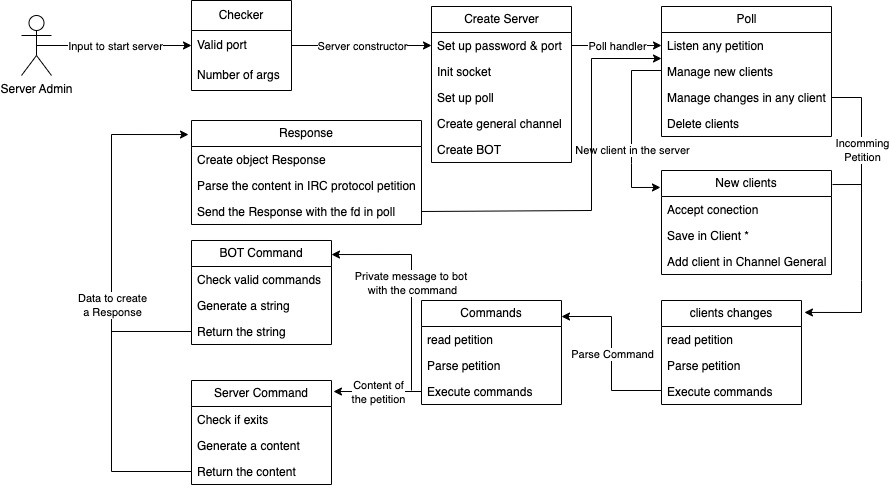

# ft_irc

This project is about creating our own IRC server. We used an actual IRC client to connect to our server and test it.

## Resources

* [Manual of IRC protocol](https://www.rfc-es.org/rfc/rfc1459-es.txt)
* [Moderm IRC protocol](https://modern.ircdocs.horse/)

#### Class diagram

### IRC commands implemented

| Command | flags | parameter | Description |
|:---------| :-------- | :------- | :------------------------- |
| `JOIN` | `none` | `channel` | join in a channel |
| `PART` | `none` | `none` | exit at current channel |
| `INVITE` | `none` | `user` | invite a user to a channel |
| `KICK` | `none` | `user` | kick a user from the channel |
| `PRIVMSG` | `none` | `message` | send a private mesasge |
| `TOPIC` | `none` | `channel topic` | set a channel topic |
| `NICK` | `none` | `new nickname` | set a nickname |
| `QUIT` | `none` | `none` | exit client-server connection |
| `KILLSERVER` | `none` | `none` | kill the server from the client |
| `MODE` | `none` | `channel` | show channel mode |
| `MODE` | `+o` | `user` | give channel operator to a user |
| `MODE` | `+l` | `limit num` | limit the channel clients |
| `MODE` | `+k` | `password` | set a password to channel |
| `MODE` | `+t` | `none` | only operators can change topic |
| `MODE` | `+i` | `none` | set only invite channel |

## Authors

- Juan Antonio García Pérez [@Juan-aga](https://github.com/Juan-aga)
- Pablo Escaño Martín [@paescano](https://github.com/Pescano)
- Pedro Reina Gañan [@pepealkalina](https://github.com/pepealkalina)
