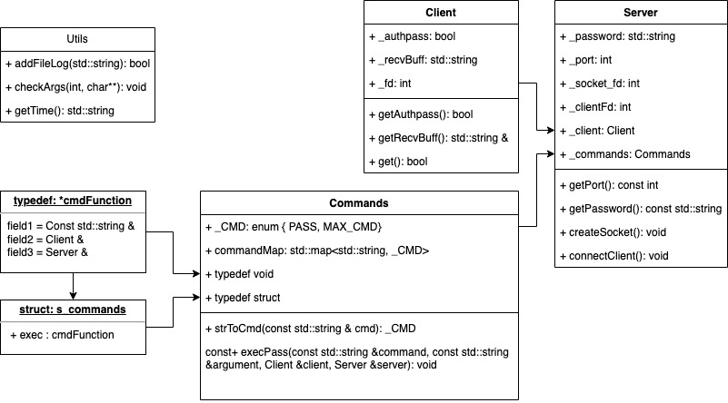

# ft_irc

This project is about creating our own IRC server. We used an actual IRC client to connect to our server and test it.

## Resources

* [Manual of IRC protocol](https://www.rfc-es.org/rfc/rfc1459-es.txt)
* [Moderm IRC protocol](https://modern.ircdocs.horse/)

#### Class diagram

## Authors

- Juan Antonio García Pérez [@Juan-aga](https://github.com/Juan-aga)
- Pablo Escaño Martín [@paescano](https://github.com/Pescano)
- Pedro Reina Gañan [@pepealkalina](https://github.com/pepealkalina)
